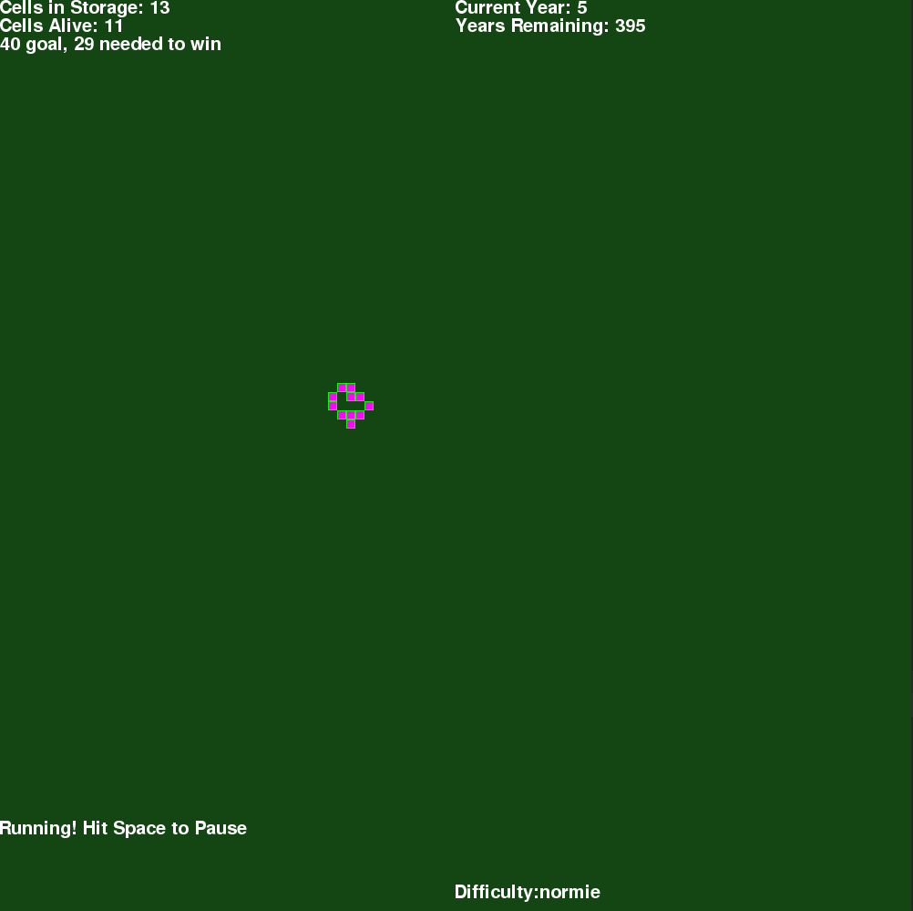

# Automata
A Conways Game of Life Puzzle Game

In Automata, you are given a limited number of cells, and must create a certain number of cells in a certain amount of time. You can pause any time, and 'pick up' cells on the board.

It starts out fairly easy, but quickly ramps up in difficulty.

## Running
`pip install -r requirements.txt`

`python main.py`

## Requirements
* Python 3.7
* pygame 1.9

---

